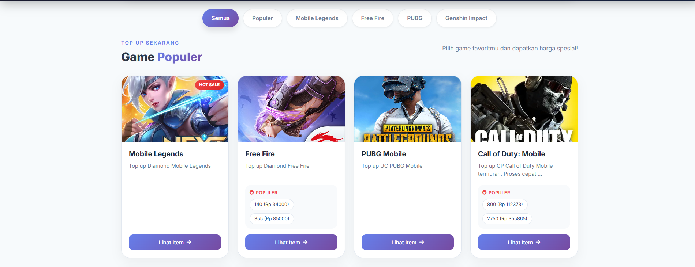
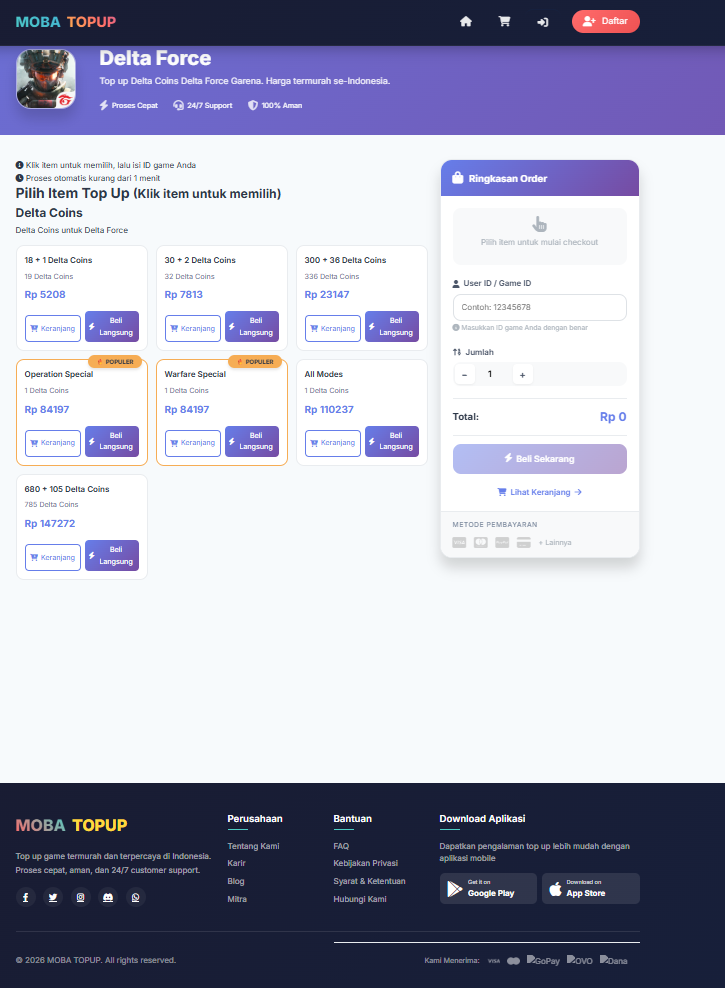
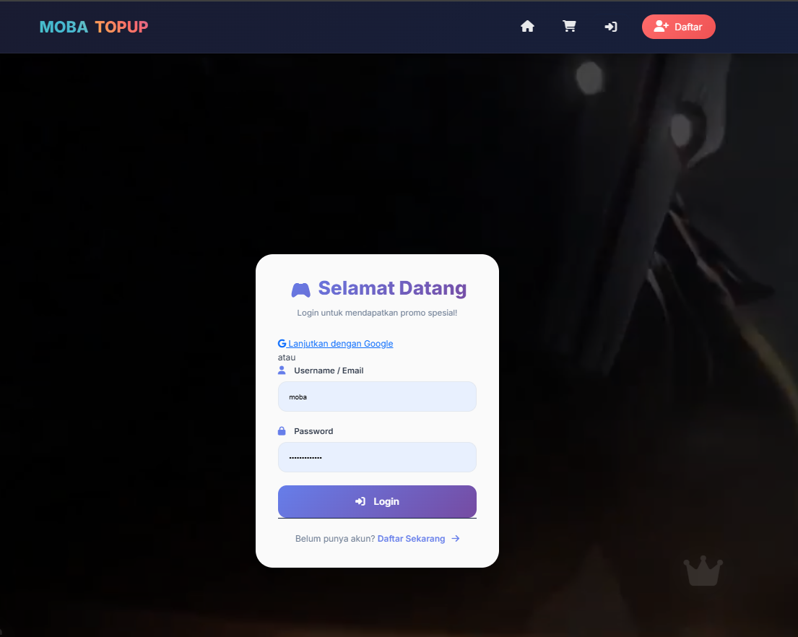
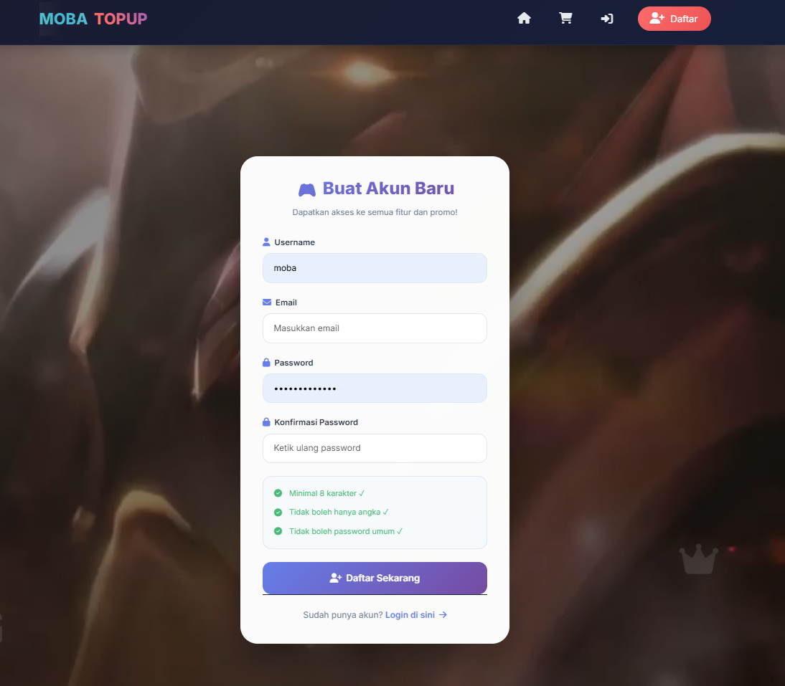
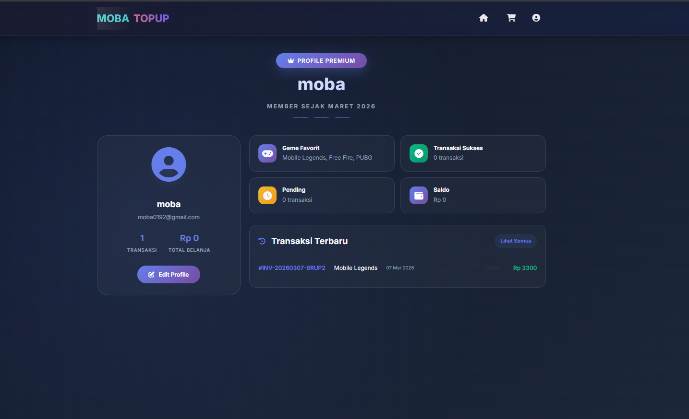
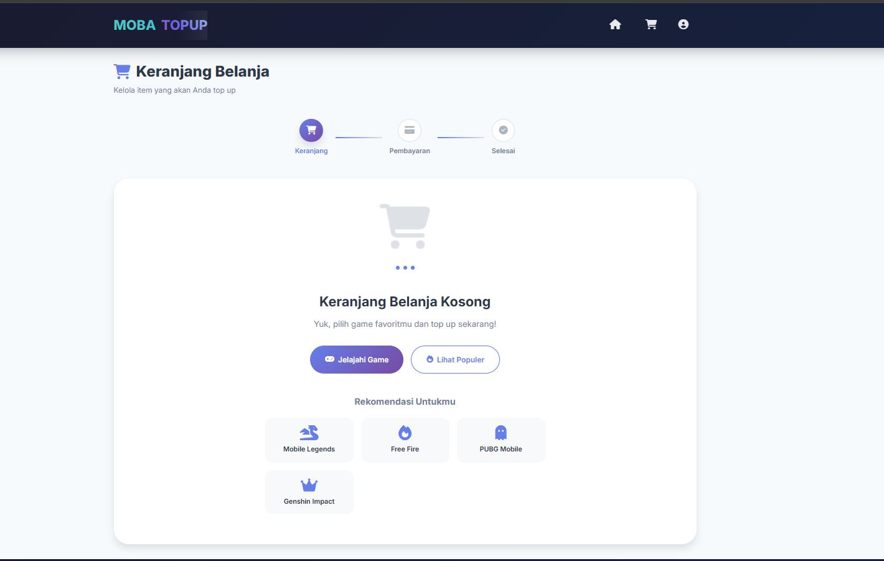
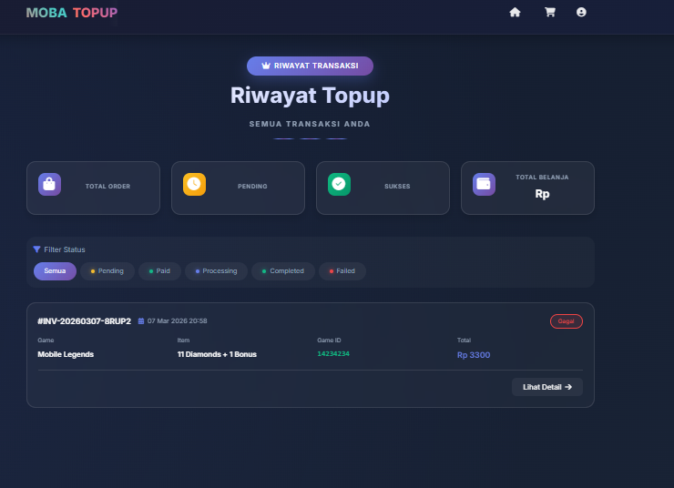
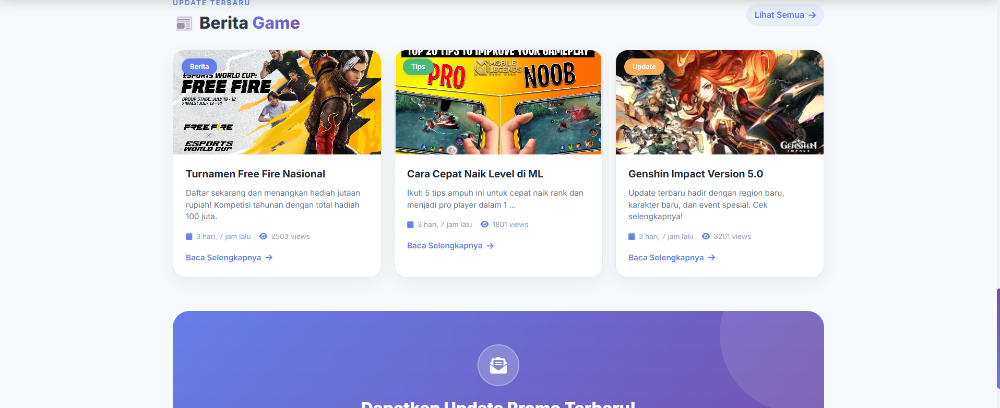

# 🎮 MOBA TOPUP - Platform Top Up Game 

<div align="center">
  
  <p><em>🏠 Halaman Utama MOBA TOPUP dengan Hero Section</em></p>
</div>

<p align="center">
  
  
  
  
  
</p>

<div align="center">
  <h3>⭐ STAR THIS PROJECT IF YOU LIKE IT! ⭐</h3>
  <p><strong>📌 Versi 1.0.0-beta | Status: 🚧 Masih dalam Pengembangan Aktif</strong></p>
</div>

---

## 📋 DAFTAR ISI

- [🎯 Tentang Proyek](#-tentang-proyek)
- [🏗️ Arsitektur Aplikasi](#️-arsitektur-aplikasi)
- [📊 Alur Aplikasi](#-alur-aplikasi)
- [✨ Fitur Lengkap](#-fitur-lengkap)
- [🛠️ Tech Stack](#️-tech-stack)
- [📸 Screenshot](#-screenshot)
- [⚙️ Instalasi](#️-instalasi)
- [🔐 Environment Variables](#-environment-variables)
- [📁 Struktur Proyek](#-struktur-proyek)
- [🧪 Hasil Testing](#-hasil-testing)
- [📈 Roadmap Pengembangan](#-roadmap-pengembangan)
- [📞 Kontak Developer](#-kontak-developer)

---

## 🎯 TENTANG PROYEK

**MOBA TOPUP** adalah platform top up game online modern yang dibangun dengan Django framework. Proyek ini dirancang untuk memberikan pengalaman terbaik dalam membeli diamond, voucher, dan item game favorit seperti Mobile Legends, Free Fire, PUBG, dan lainnya.

| Keterangan | Detail |
|------------|--------|
| 🚧 Versi Saat Ini | 1.0.0-beta |
| ⏳ Progress | 65% (Fitur utama sudah berfungsi) |
| 🔄 Last Update | Maret 2026 |
| 🎯 Target Rilis | Q3 2026 |

---


## 🏗️ ARSITEKTUR APLIKASI

┌─────────────────────────────────────────────────────────────┐
│                     CLIENT LAYER                            │
│ ┌──────────┐ ┌──────────┐ ┌──────────┐ ┌──────────┐         │
│ │ Browser  │ │ Mobile   │ │ API      │ │ Admin    │         │
│ │ Web      │ │Responsive│ │ Client   │ │ Panel    │         │
│ └──────────┘ └──────────┘ └──────────┘ └──────────┘         │
└─────────────────────────────────────────────────────────────┘
                             │
                             ▼
┌─────────────────────────────────────────────────────────────┐
│                       PRESENTATION LAYER                    │
│ ┌──────────────────────────────────────────────────────┐    │
│ │         Django Templates (HTML/CSS/JS)               │    │
│ │         - Bootstrap 5 - Font Awesome                 │    │
│ │         - AOS Animation - Custom CSS/JS              │    │
│ └──────────────────────────────────────────────────────┘    │
└─────────────────────────────────────────────────────────────┘
                            │
                            ▼
┌─────────────────────────────────────────────────────────────┐
│                        APPLICATION LAYER                    │
│ ┌──────────────────────────────────────────────────────┐    │
│ │                     Django Core                      │    │
│ │ ┌────────────┐ ┌────────────┐ ┌────────────┐         │    │
│ │ │ Views      │ │ Models     │ │ Forms      │         │    │
│ │ └────────────┘ └────────────┘ └────────────┘         │    │
│ │                                                      │    │
│ │ ┌────────────┐ ┌────────────┐ ┌────────────┐         │    │
│ │ │ games      │ │ orders     │ │ users      │         │    │
│ │ └────────────┘ └────────────┘ └────────────┘         │    │
│ └──────────────────────────────────────────────────────┘    │
└─────────────────────────────────────────────────────────────┘
                            │
                            ▼
┌─────────────────────────────────────────────────────────────┐
│                       SERVICE LAYER                         │
│ ┌──────────────────────────────────────────────────────┐    │
│ │ ┌────────────┐ ┌────────────┐ ┌────────────┐         │    │
│ │ │ Midtrans   │ │ Email      │ │ Celery     │         │    │
│ │ │ Payment    │ │ Service    │ │ (Future)   │         │    │
│ │ └────────────┘ └────────────┘ └────────────┘         │    │
│ └──────────────────────────────────────────────────────┘    │
└─────────────────────────────────────────────────────────────┘
                            │
                            ▼
┌─────────────────────────────────────────────────────────────┐
│                       DATA LAYER                            │
│ ┌──────────────────────────────────────────────────────┐    │
│ │ ┌────────────┐ ┌────────────┐ ┌────────────┐         │    │
│ │ │ SQLite3    │ │ PostgreSQL │ │ Redis      │         │    │
│ │ │ (Dev)      │ │ (Prod)     │ │ (Cache)    │         │    │
│ │ └────────────┘ └────────────┘ └────────────┘         │    │
│ └──────────────────────────────────────────────────────┘    │
└─────────────────────────────────────────────────────────────┘


---
---

## 📊 ALUR APLIKASI
                ┌─────────────┐
                │ Home Page   │
                └──────┬──────┘
                       │
                       ▼
                ┌─────────────┐
                │ Pilih Game  │
                └──────┬──────┘
                       │
                       ▼
                ┌─────────────┐
                │ Detail Game │
                └──────┬──────┘
                       │
                       ▼
                ┌─────────────┐
                │ Pilih Item  │
                └──────┬──────┘
                       │
        ┌──────────────┼──────────────┐
        ▼              ▼              ▼
       ┌─────────────┐ ┌─────────────┐ ┌─────────────┐
       │Add to Cart  │ │   Buy Now   │ │    Continue │
       └──────┬──────┘ └──────┬──────┘ └─────────────┘
              │               │
              ▼               ▼
       ┌─────────────┐ ┌─────────────┐
       │ Cart Page   │ │   Checkout │
       └──────┬──────┘ └──────┬──────┘
              └─────────┬─────┘
                        ▼
              ┌─────────────────┐
              │ Create Order    │
              └────────┬────────┘
                       ▼
              ┌─────────────────┐
              │ Payment Page    │
              └────────┬────────┘
                       ▼
              ┌─────────────────┐
              │ Order History   │
              └─────────────────┘
---

---

# ✨ Features

## 🎮 Core Features

| Feature                      | Status |
| ---------------------------- | ------ |
| Game Management              | ✅     |
| Category Management          | ✅     |
| Item / Product Management    | ✅     |
| Article Management           | ✅     |
| Shopping Cart                | ✅     |
| Checkout System              | ✅     |
| Midtrans Payment Integration | ✅     |
| Order History                | ✅     |
| User Profile                 | ✅     |
| Search & Filter              | ✅     |
| Pagination                   | ✅     |

---

## 🔐 Authentication

| Feature             | Status |
| ------------------- | ------ |
| Register            | ✅     |
| Login               | ✅     |
| Logout              | ✅     |
| Google Login        | ✅     |
| Password Validation | ✅     |
| CSRF Protection     | ✅     |

---

## 💳 Payment Features

| Feature                  | Status |
| ------------------------ | ------ |
| Midtrans Integration     | ✅     |
| Multiple Payment Methods | ✅     |
| Invoice Generation       | ✅     |
| Payment Status Tracking  | ✅     |
| Countdown Timer          | ✅     |
| Webhook Auto Update      | ✅     |
| Guest Checkout           | ✅     |

---

## 📱 UI / UX Features

| Feature                       | Status |
| ----------------------------- | ------ |
| Responsive Design             | ✅     |
| Video Background              | ✅     |
| AOS Animations                | ✅     |
| Toast Notifications           | ✅     |
| Preloader                     | ✅     |
| Back To Top Button            | ✅     |
| Floating Icons                | ✅     |
| Dark Theme                    | ✅     |
| Mobile Floating Action Button | ✅     |

---

# 🛠️ Tech Stack

## Backend

| Technology      | Version     |
| --------------- | ----------- |
| Python          | 3.11.9      |
| Django          | 5.1.15      |
| SQLite3         | Development |
| PostgreSQL      | Production  |
| Django Allauth  | 65.14.3     |
| Midtrans Client | 1.4.2       |
| Pillow          | 11.1.0      |

---

## Frontend

| Technology    | Version |
| ------------- | ------- |
| HTML5         | -       |
| CSS3          | -       |
| JavaScript    | ES6     |
| Bootstrap     | 5.3.0   |
| Font Awesome  | 6.4.0   |
| AOS Animation | 2.3.1   |

---

# 📸 Screenshots

<div align="center">

<table>
<tr>
<td></td>
<td></td>
<td></td>
</tr>

<tr>
<td align="center"><b>Home Page</b></td>
<td align="center"><b>Game List</b></td>
<td align="center"><b>Game Detail</b></td>
</tr>

<tr>
<td></td>
<td></td>
<td></td>
</tr>

<tr>
<td align="center"><b>Login Page</b></td>
<td align="center"><b>Register Page</b></td>
<td align="center"><b>User Profile</b></td>
</tr>

<tr>
<td></td>
<td></td>
<td></td>
</tr>

<tr>
<td align="center"><b>Shopping Cart</b></td>
<td align="center"><b>Topup History</b></td>
<td align="center"><b>Game Articles</b></td>
</tr>

</table>

</div>

---

# ⚙️ Installation

Clone the repository

```bash
git clone https://github.com/mobah0192/moba-topup.git
cd moba-topup
```

Create virtual environment

```bash
python -m venv venv
```

Activate virtual environment

Windows

```bash
venv\Scripts\activate
```

Mac / Linux

```bash
source venv/bin/activate
```

Install dependencies

```bash
pip install -r requirements.txt
```

Setup database

```bash
python manage.py migrate
python manage.py createsuperuser
```

Run development server

```bash
python manage.py runserver
```

Open browser

```
http://127.0.0.1:8000
```

---

---

# 🔐 Environment Variables

This project uses environment variables to store sensitive configuration such as **secret keys** and **payment gateway credentials**.

Create a `.env` file in the project root directory.

Example configuration:

```env
# Django Configuration
SECRET_KEY=your-secret-key-here
DEBUG=True

# Midtrans Configuration
MIDTRANS_MERCHANT_ID=your-merchant-id
MIDTRANS_CLIENT_KEY=your-client-key
MIDTRANS_SERVER_KEY=your-server-key
MIDTRANS_IS_PRODUCTION=False
```

### Notes

* Never commit your `.env` file to GitHub
* Always store sensitive credentials securely
* For production deployment, use `DEBUG=False`

Add `.env` to your `.gitignore` file:

```gitignore
.env
```

---


---

# 🧪 Testing Results

All major features of the application have been tested to ensure functionality, stability, and responsiveness across devices.

| Category            | Total Features | Result        |
| ------------------- | -------------- | ------------- |
| User Authentication | 8              | ✅ 100% Passed |
| Game & Shopping     | 7              | ✅ 100% Passed |
| Shopping Cart       | 7              | ✅ 100% Passed |
| Checkout & Payment  | 9              | ✅ 100% Passed |
| Order Management    | 7              | ✅ 100% Passed |
| Profile             | 7              | ✅ 100% Passed |
| Articles            | 6              | ✅ 100% Passed |
| Responsive Design   | 4              | ✅ 100% Passed |
| Security            | 6              | ✅ 100% Passed |

---

### 📊 Summary

* **Total Features Tested:** 61
* **Successful Tests:** 61
* **Success Rate:** **100% ✅**

All core systems including **authentication, shopping cart, checkout, payment integration, and order management** are functioning as expected.

---

WEB_TOPUP/
├── apps/                               # Django applications
│   ├── core/                           # Core functionality
│   │   ├── management/                  # Custom commands
│   │   ├── migrations/                   # Database migrations
│   │   ├── templatetags/                 # Custom template tags
│   │   ├── utils/                        # Utility functions
│   │   ├── __init__.py
│   │   ├── admin.py
│   │   ├── apps.py
│   │   ├── models.py
│   │   ├── tests.py
│   │   └── views.py
│   │
│   ├── games/                           # Game management
│   │   ├── migrations/
│   │   ├── __init__.py
│   │   ├── admin.py
│   │   ├── apps.py
│   │   ├── models.py                      # Game, Category, Item, Article
│   │   ├── tests.py
│   │   ├── urls.py                        # Game URLs
│   │   └── views.py                       # Game views
│   │
│   ├── orders/                           # Order & payment
│   │   ├── api/                           # API endpoints
│   │   ├── fixtures/                       # Sample data
│   │   ├── migrations/
│   │   ├── services/                       # Midtrans service
│   │   │   └── midtrans_service.py
│   │   ├── tests/
│   │   ├── __init__.py
│   │   ├── admin.py
│   │   ├── apps.py
│   │   ├── cart.py                         # Shopping cart logic
│   │   ├── forms.py                        # Order forms
│   │   ├── models.py                       # Order, PaymentMethod
│   │   ├── urls.py                         # Order URLs
│   │   └── views.py                        # Cart, checkout, payment
│   │
│   └── users/                            # User management
│       ├── migrations/
│       ├── tests/
│       ├── __init__.py
│       ├── admin.py                        # User admin
│       ├── apps.py
│       ├── forms.py                        # User forms
│       ├── models.py                       # CustomUser model
│       ├── urls.py                         # User URLs
│       └── views.py                        # Auth views
│
├── config/                               # Project configuration
│   ├── __init__.py
│   ├── asgi.py
│   ├── settings.py                        # Django settings
│   ├── urls.py                            # Main URLs
│   └── wsgi.py                            # WSGI config
│
├── static/                                # Static files
│   ├── audio/                              # Background music
│   ├── css/
│   │   └── style.css                       # Master stylesheet
│   ├── images/                             # Icons and images
│   ├── js/
│   │   ├── hero-video.js                    # Video background
│   │   ├── music.js                         # Audio player
│   │   ├── password-validation.js           # Password strength
│   │   └── script.js                        # Master JavaScript
│   └── videos/                              # Background videos
│
├── templates/                             # HTML templates
│   ├── base.html                           # Base template
│   ├── games/
│   │   ├── article_detail.html
│   │   ├── article_list.html
│   │   ├── game_detail.html
│   │   ├── game_list.html
│   │   └── search.html
│   ├── includes/
│   │   ├── footer.html
│   │   └── navbar.html
│   ├── orders/
│   │   ├── cart_detail.html
│   │   ├── checkout.html
│   │   ├── guest_checkout.html
│   │   ├── order_create.html
│   │   ├── order_detail.html
│   │   ├── order_list.html
│   │   └── order_payment.html
│   └── users/
│       ├── auth_base.html
│       ├── login.html
│       ├── profile.html
│       ├── profile_edit.html
│       └── register.html
│
├── media/                                 # User uploaded files
│   ├── articles/
│   ├── games/
│   └── payments/
│
├── venv/                                  # Virtual environment
├── htmlcov/                               # Coverage reports
├── .env                                    # Environment variables
├── .env.example                            # Example environment
├── .gitignore                              # Git ignore file
├── backup_before_reset.json                 # Database backup
├── cek_user.py                             # Utility script
├── db.sqlite3                              # SQLite database
├── manage.py                               # Django CLI
├── requirements.txt                        # Dependencies
└── TESTING.md                              # Testing checklist

---

# 📈 Roadmap Pengembangan

## ✅ Versi 1.0.0 (Current)

Fitur yang sudah tersedia pada versi saat ini:

* Autentikasi Pengguna
* Manajemen Game & Item
* Shopping Cart
* Checkout & Integrasi Midtrans
* Riwayat Pesanan
* Profil Pengguna
* Artikel Game

---

## 🚧 Versi 1.1.0 (Q2 2026)

Pengembangan fitur berikutnya:

* Wishlist
* Sistem Review & Rating
* Sistem Voucher / Promo
* Notifikasi Email
* Export Data Transaksi

---

## 📅 Versi 1.2.0 (Q3 2026)

Pengembangan lanjutan untuk meningkatkan performa dan integrasi:

* REST API
* Dark Mode
* Dashboard Analytics
* Caching dengan Redis

---

# 📞 Kontak Developer

**Gilang Rahmat Abiasah**
Junior Full Stack Web Developer

| Platform   | Kontak                                          |
| ---------- | ----------------------------------------------- |
| 📧 Email   | [moba0192@gmail.com](mailto:moba0192@gmail.com) |
| 🐙 GitHub  | https://github.com/mobah0192                    |
| 🐦 Twitter | https://twitter.com/moba0192                    |

---

# 🙏 Acknowledgments

Terima kasih kepada berbagai teknologi dan komunitas yang membantu pengembangan proyek ini:

* Django Community
* Midtrans
* Bootstrap
* Font Awesome
* Semua kontributor open source

---

<div align="center">


### ⭐ Jangan lupa kasih bintang di repository ini ⭐

© 2026 **MOBA TOPUP**
Dibuat dengan ❤️ di Indonesia

[⬆️ Kembali ke Atas](#)

</div>

---
